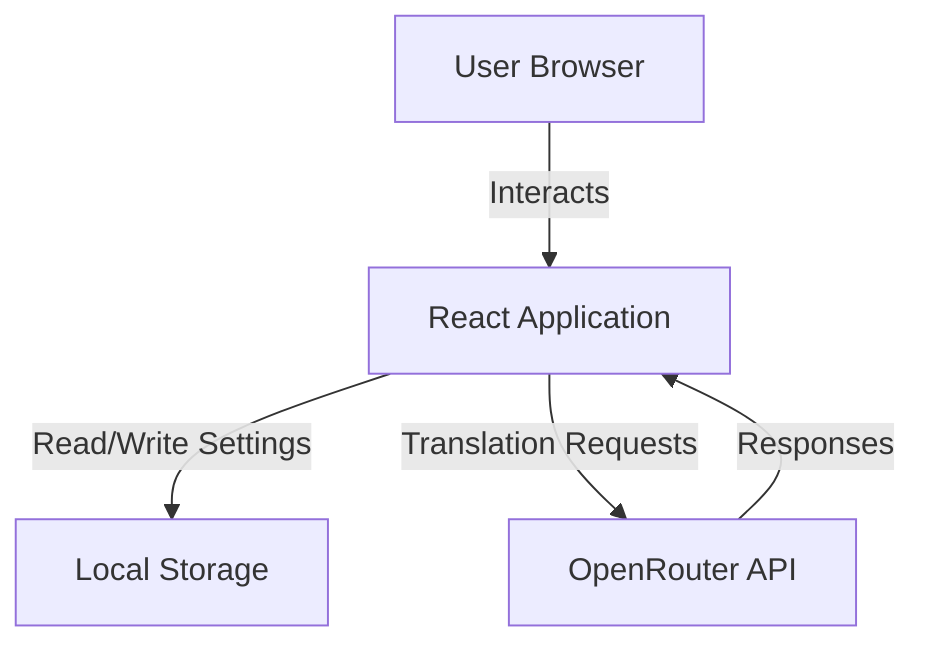
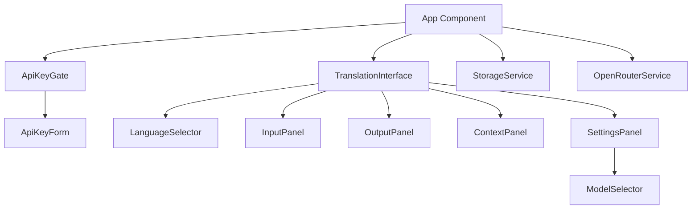

# Design Document

## Overview

Clanker Translate is a client-side React application that provides AI-powered translation with contextual awareness. The application uses OpenRouter as a unified gateway to access various AI models, with a focus on OpenAI's model catalog. The architecture emphasizes privacy (all data stays local), simplicity (no backend), and testability (comprehensive unit and property-based testing).

The application follows a gated approach where users must provide an API key before accessing the translation interface. All settings (API key, selected model, language preferences) are persisted in browser Local Storage.

## Architecture

### High-Level Architecture



### Component Architecture



### Data Flow

1. **Initial Load**: App checks Local Storage for API key
2. **No Key**: Display ApiKeyGate component
3. **Key Present**: Load settings, fetch models, display TranslationInterface
4. **Translation**: User input → OpenRouterService → API → Response → Display
5. **Settings Update**: User changes → StorageService → Local Storage

## Components and Interfaces

### Core Components

#### App Component
- **Responsibility**: Root component, manages application state and routing between API key gate and translation interface
- **State**: 
  - `apiKey: string | null`
  - `hasValidKey: boolean`
  - `selectedModel: string | null`
  - `availableModels: Model[]`
- **Methods**:
  - `loadSettings()`: Load API key and preferences from Local Storage
  - `handleApiKeySubmit(key: string)`: Validate and store API key
  - `handleClearApiKey()`: Clear API key and return to gate (called from settings)

#### ApiKeyGate Component
- **Responsibility**: Prompt user for API key before allowing access
- **Props**: 
  - `onSubmit: (key: string) => void`
- **State**:
  - `inputKey: string`
  - `isValidating: boolean`
  - `error: string | null`
- **Methods**:
  - `validateKey()`: Test API key with OpenRouter
  - `handleSubmit()`: Submit validated key to parent

#### TranslationInterface Component
- **Responsibility**: Main translation UI container
- **Props**:
  - `apiKey: string`
  - `selectedModel: string`
  - `onModelChange: (model: string) => void`
- **State**:
  - `sourceText: string`
  - `translatedText: string`
  - `explanation: string`
  - `transcription: string`
  - `fromLanguage: string`
  - `toLanguage: string`
  - `context: string`
  - `isTranslating: boolean`
  - `error: string | null`
- **Methods**:
  - `handleTranslate()`: Trigger translation request
  - `handleSwapLanguages()`: Swap source and target languages
  - `handleClear()`: Clear all fields

#### LanguageSelector Component
- **Responsibility**: Language selection dropdowns with swap button
- **Props**:
  - `fromLanguage: string`
  - `toLanguage: string`
  - `onFromChange: (lang: string) => void`
  - `onToChange: (lang: string) => void`
  - `onSwap: () => void`
- **State**: None (controlled component)

#### InputPanel Component
- **Responsibility**: Text input area with controls
- **Props**:
  - `value: string`
  - `onChange: (text: string) => void`
  - `onPaste: () => void`
  - `onCopy: () => void`
  - `onClear: () => void`
  - `maxLength: number`
- **State**: None (controlled component)
- **Features**:
  - Character counter
  - Paste/Copy/Clear buttons
  - Auto-resize textarea

#### OutputPanel Component
- **Responsibility**: Display translation results
- **Props**:
  - `translation: string`
  - `explanation: string`
  - `transcription: string`
  - `onCopy: () => void`
- **State**: None (controlled component)
- **Features**:
  - Copy button
  - Conditional rendering of explanation and transcription

#### ContextPanel Component
- **Responsibility**: Optional context input
- **Props**:
  - `value: string`
  - `onChange: (text: string) => void`
- **State**: None (controlled component)

#### SettingsPanel Component
- **Responsibility**: Model selection and settings management
- **Props**:
  - `selectedModel: string`
  - `availableModels: Model[]`
  - `onModelChange: (model: string) => void`
  - `onClearApiKey: () => void`
- **State**:
  - `isOpen: boolean`
- **Methods**:
  - `toggleOpen()`: Show/hide settings

#### ModelSelector Component
- **Responsibility**: Dropdown for model selection
- **Props**:
  - `selectedModel: string`
  - `models: Model[]`
  - `onChange: (model: string) => void`
- **State**: None (controlled component)

### Service Layer

#### StorageService
- **Responsibility**: Manage Local Storage operations
- **Methods**:
  - `getApiKey(): string | null`
  - `setApiKey(key: string): void`
  - `clearApiKey(): void`
  - `getSelectedModel(): string | null`
  - `setSelectedModel(model: string): void`
  - `getLanguagePreferences(): LanguagePrefs`
  - `setLanguagePreferences(prefs: LanguagePrefs): void`

#### OpenRouterService
- **Responsibility**: Handle all OpenRouter API interactions
- **Methods**:
  - `validateApiKey(key: string): Promise<boolean>`
  - `fetchModels(key: string): Promise<Model[]>`
  - `translate(request: TranslationRequest): Promise<TranslationResponse>`
- **Error Handling**: Throw typed errors for different failure modes

## Data Models

### TypeScript Interfaces

```typescript
interface Model {
  id: string;
  name: string;
  description?: string;
  contextLength?: number;
}

interface TranslationRequest {
  apiKey: string;
  model: string;
  sourceText: string;
  fromLanguage: string;
  toLanguage: string;
  context?: string;
}

interface TranslationResponse {
  translation: string;
  explanation?: string;
  transcription?: string;
  detectedLanguage?: string;
}

interface LanguagePrefs {
  fromLanguage: string;
  toLanguage: string;
}

interface StoredSettings {
  apiKey: string;
  selectedModel: string;
  languagePrefs: LanguagePrefs;
}

interface OpenRouterError {
  type: 'auth' | 'rate_limit' | 'network' | 'invalid_response' | 'unknown';
  message: string;
  statusCode?: number;
}
```

### Supported Languages

```typescript
const LANGUAGES = [
  { code: 'auto', name: 'Detect Language' },
  { code: 'en', name: 'English' },
  { code: 'ja', name: 'Japanese' },
  { code: 'es', name: 'Spanish' },
  { code: 'fr', name: 'French' },
  { code: 'de', name: 'German' },
  { code: 'zh', name: 'Chinese' },
  { code: 'ko', name: 'Korean' },
  { code: 'ar', name: 'Arabic' },
  { code: 'ru', name: 'Russian' },
  { code: 'pt', name: 'Portuguese' },
] as const;
```

## Correctness Properties

*A property is a characteristic or behavior that should hold true across all valid executions of a system-essentially, a formal statement about what the system should do. Properties serve as the bridge between human-readable specifications and machine-verifiable correctness guarantees.*

### Property 1: API Key Persistence Round Trip
*For any* valid API key string, storing it via StorageService and then retrieving it should return the exact same key value.
**Validates: Requirements 6.2, 6.3**

### Property 2: Model Selection Persistence
*For any* valid model ID from the available models list, storing it as the selected model and then retrieving it should return the same model ID.
**Validates: Requirements 5.4**

### Property 3: Language Swap Idempotence
*For any* pair of languages (from, to) where neither is "auto", swapping twice should return to the original configuration.
**Validates: Requirements 7.4**

### Property 4: Empty Input Validation
*For any* whitespace-only string (including empty string), the translate button should be disabled and translation should not be triggered.
**Validates: Requirements 8.5, 11.1**

### Property 5: Translation Request Format
*For any* valid translation request, the formatted API payload should include all required fields (model, messages, temperature) and match OpenRouter's API specification.
**Validates: Requirements 1.1**

### Property 6: Error Message Display
*For any* API error response, the system should extract and display a user-friendly error message without exposing sensitive information.
**Validates: Requirements 11.3, 11.4**

### Property 7: Character Count Accuracy
*For any* input text, the displayed character count should equal the actual length of the text string.
**Validates: Requirements 8.4**

### Property 8: Settings Persistence Completeness
*For any* complete settings object (API key, model, language preferences), storing and retrieving should preserve all fields without data loss.
**Validates: Requirements 13.4**

### Property 9: Copy Operation Fidelity
*For any* translated text including special characters and whitespace, copying to clipboard should preserve the exact content.
**Validates: Requirements 9.1**

### Property 10: Model List Filtering
*For any* list of models returned from OpenRouter, filtering for OpenAI models should only include models with IDs starting with "openai/".
**Validates: Requirements 5.1, 5.2**

## Error Handling

### Error Categories

1. **Authentication Errors**
   - Invalid API key
   - Expired API key
   - Missing API key
   - **Handling**: Display clear message, prompt for new key

2. **Network Errors**
   - Connection timeout
   - No internet connection
   - DNS resolution failure
   - **Handling**: Display retry option, suggest checking connection

3. **Rate Limiting**
   - Too many requests
   - Quota exceeded
   - **Handling**: Display wait time, suggest trying later

4. **Validation Errors**
   - Empty input
   - Text too long
   - Invalid language selection
   - **Handling**: Inline validation messages, disable submit

5. **API Response Errors**
   - Malformed JSON
   - Missing required fields
   - Unexpected format
   - **Handling**: Log error, display generic message, allow retry

### Error Display Strategy

- **Banner**: Top of interface for critical errors (auth, network)
- **Inline**: Next to relevant field for validation errors
- **Toast**: Brief notifications for success/info messages
- **Modal**: For errors requiring user decision (e.g., key expired)

### Error Recovery

```typescript
interface ErrorRecovery {
  retryable: boolean;
  retryDelay?: number;
  fallbackAction?: () => void;
  userAction?: string;
}
```

## Testing Strategy

### Unit Testing

We'll use **Vitest** as the testing framework for its speed and Vite integration.

**Unit Test Coverage:**

1. **Component Tests**
   - Render tests for all components
   - User interaction tests (clicks, typing, form submission)
   - Conditional rendering based on props/state
   - Event handler invocation

2. **Service Tests**
   - StorageService: get/set operations with mocked localStorage
   - OpenRouterService: API calls with mocked fetch
   - Error handling for each service method

3. **Utility Tests**
   - Language code conversions
   - Text formatting functions
   - Validation functions

**Example Unit Test Structure:**
```typescript
describe('StorageService', () => {
  beforeEach(() => {
    localStorage.clear();
  });

  it('should store and retrieve API key', () => {
    const key = 'test-key-123';
    StorageService.setApiKey(key);
    expect(StorageService.getApiKey()).toBe(key);
  });

  it('should return null when no API key is stored', () => {
    expect(StorageService.getApiKey()).toBeNull();
  });
});
```

### Property-Based Testing

We'll use **fast-check** for property-based testing.

**Configuration:**
- Minimum 100 iterations per property test
- Each property test tagged with: `**Feature: ai-translator, Property {number}: {description}**`

**Property Test Implementation:**

Each correctness property listed above will be implemented as a property-based test. The tests will generate random valid inputs and verify the properties hold.

**Example Property Test:**
```typescript
import fc from 'fast-check';

describe('Property Tests', () => {
  it('Property 1: API Key Persistence Round Trip', () => {
    /**
     * Feature: ai-translator, Property 1: API Key Persistence Round Trip
     * Validates: Requirements 6.2, 6.3
     */
    fc.assert(
      fc.property(
        fc.string({ minLength: 1, maxLength: 200 }),
        (apiKey) => {
          StorageService.setApiKey(apiKey);
          const retrieved = StorageService.getApiKey();
          expect(retrieved).toBe(apiKey);
        }
      ),
      { numRuns: 100 }
    );
  });

  it('Property 3: Language Swap Idempotence', () => {
    /**
     * Feature: ai-translator, Property 3: Language Swap Idempotence
     * Validates: Requirements 7.4
     */
    fc.assert(
      fc.property(
        fc.constantFrom('en', 'ja', 'es', 'fr', 'de', 'zh', 'ko'),
        fc.constantFrom('en', 'ja', 'es', 'fr', 'de', 'zh', 'ko'),
        (from, to) => {
          const initial = { from, to };
          const swapped = { from: to, to: from };
          const swappedTwice = { from: swapped.to, to: swapped.from };
          expect(swappedTwice).toEqual(initial);
        }
      ),
      { numRuns: 100 }
    );
  });
});
```

### Integration Testing

**Scope**: Test component interactions and data flow

1. **API Key Flow**
   - Submit key → Store → Load → Display interface
   - Invalid key → Error → Retry

2. **Translation Flow**
   - Input text → Select languages → Translate → Display result
   - With context → Enhanced translation
   - Error handling → Retry

3. **Settings Flow**
   - Change model → Store → Persist → Reload
   - Logout → Clear data → Return to gate

### Test Organization

```
src/
  components/
    __tests__/
      App.test.tsx
      ApiKeyGate.test.tsx
      TranslationInterface.test.tsx
      ...
  services/
    __tests__/
      StorageService.test.tsx
      OpenRouterService.test.tsx
  __tests__/
    properties/
      storage.properties.test.tsx
      translation.properties.test.tsx
      validation.properties.test.tsx
```

### Testing Best Practices

1. **Isolation**: Each test should be independent
2. **Mocking**: Mock external dependencies (localStorage, fetch)
3. **Coverage**: Aim for >80% code coverage
4. **Fast**: Unit tests should run in <5 seconds total
5. **Descriptive**: Test names should clearly describe what they verify
6. **Property Tests**: Focus on invariants and round-trip properties
7. **Edge Cases**: Test boundary conditions explicitly

## OpenRouter Integration

### API Endpoint

```
Base URL: https://openrouter.ai/api/v1
```

### Authentication

```typescript
headers: {
  'Authorization': `Bearer ${apiKey}`,
  'Content-Type': 'application/json',
  'HTTP-Referer': window.location.origin,
  'X-Title': 'Clanker Translate'
}
```

### Model Listing

```typescript
// GET /api/v1/models
// Response: { data: Model[] }
```

### Translation Request

```typescript
// POST /api/v1/chat/completions
{
  model: string,
  messages: [
    {
      role: 'system',
      content: 'You are an expert translator...'
    },
    {
      role: 'user',
      content: 'Translate from {from} to {to}: {text}\nContext: {context}'
    }
  ],
  temperature: 0.3,
  max_tokens: 1000
}
```

### Response Parsing

The AI response will be in JSON format:
```json
{
  "translation": "translated text",
  "explanation": "explanation of choices",
  "transcription": "phonetic transcription (optional)"
}
```

We'll instruct the model to return this format and parse it accordingly.

## UI/UX Design

### Visual Design

- **Theme**: Dark mode by default
- **Colors**: 
  - Background: `#1a1a1a`
  - Surface: `#2d2d2d`
  - Primary: `#3b82f6` (blue)
  - Text: `#e5e5e5`
  - Muted: `#a3a3a3`
- **Typography**: System font stack
- **Spacing**: 8px base unit
- **Border Radius**: 8px for cards, 4px for inputs

### Layout

**API Key Gate:**
```
┌─────────────────────────────────┐
│         Clanker Translate       │
│                                 │
│  Enter your OpenRouter API Key  │
│  ┌───────────────────────────┐ │
│  │                           │ │
│  └───────────────────────────┘ │
│         [Submit Key]            │
└─────────────────────────────────┘
```

**Translation Interface:**
```
┌─────────────────────────────────────────┐
│  Clanker Translate        [Settings]    │
├─────────────────────────────────────────┤
│  [From: English ⇄ To: Japanese]         │
├─────────────────────────────────────────┤
│  Input                │  Output          │
│  ┌─────────────────┐ │ ┌──────────────┐ │
│  │                 │ │ │              │ │
│  │                 │ │ │              │ │
│  └─────────────────┘ │ └──────────────┘ │
│  [Paste][Copy][Clear]│ [Copy]           │
├─────────────────────────────────────────┤
│  Context (optional)                     │
│  ┌───────────────────────────────────┐ │
│  │                                   │ │
│  └───────────────────────────────────┘ │
├─────────────────────────────────────────┤
│           [Translate]                   │
└─────────────────────────────────────────┘
```

### Responsive Breakpoints

- **Mobile**: < 768px (single column)
- **Tablet**: 768px - 1024px (flexible layout)
- **Desktop**: > 1024px (two-column)

### Accessibility

- **Keyboard Navigation**: Full support with visible focus indicators
- **Screen Readers**: Proper ARIA labels and roles
- **Color Contrast**: WCAG AA compliance
- **Focus Management**: Logical tab order

## Performance Considerations

### Optimization Strategies

1. **Lazy Loading**: Code split settings panel
2. **Debouncing**: Character count updates
3. **Memoization**: Expensive computations (language lists)
4. **Request Cancellation**: Cancel in-flight requests on new translation
5. **Local Caching**: Cache model list for 24 hours

### Bundle Size

- Target: < 200KB gzipped
- React + React DOM: ~130KB
- Application code: ~50KB
- Dependencies: ~20KB

## Security Considerations

### API Key Storage

- Stored in Local Storage (not cookies)
- Never logged or sent to analytics
- Only transmitted to OpenRouter
- User warned about shared device risks

### Content Security Policy

```
default-src 'self';
connect-src 'self' https://openrouter.ai;
script-src 'self';
style-src 'self' 'unsafe-inline';
```

### Input Sanitization

- No HTML rendering of user input
- Text-only display
- XSS prevention through React's default escaping

## Deployment

### Build Process

```bash
npm run build
# Output: dist/
```

### Hosting

- **Platform**: GitHub Pages (or any static host)
- **URL**: Custom domain or github.io subdomain
- **HTTPS**: Required for clipboard API

### CI/CD

```yaml
# .github/workflows/deploy.yml
- Run tests
- Build production bundle
- Deploy to GitHub Pages
```

## Future Enhancements

### Phase 2 Features

1. **Translation History**: Store past translations locally
2. **Favorites**: Save frequently used phrases
3. **Batch Translation**: Translate multiple texts at once
4. **Export**: Download translations as text/JSON
5. **Voice Input**: Speech-to-text for input
6. **OCR**: Camera text capture for mobile

### Phase 3 Features

1. **PWA**: Offline support with service worker
2. **Multi-Provider**: Support Anthropic, Google, etc.
3. **Custom Prompts**: User-defined system prompts
4. **Themes**: Light mode and custom themes
5. **Keyboard Shortcuts**: Power user features

## Development Setup

### Prerequisites

- Node.js 18+
- npm or yarn

### Installation

```bash
npm install
```

### Development Server

```bash
npm run dev
```

### Testing

```bash
npm test              # Run all tests
npm run test:unit     # Unit tests only
npm run test:property # Property tests only
npm run test:coverage # Coverage report
```

### Build

```bash
npm run build
npm run preview  # Preview production build
```

## Dependencies

### Core

- `react`: ^18.3.0
- `react-dom`: ^18.3.0

### Development

- `vite`: ^5.0.0
- `vitest`: ^1.0.0
- `@testing-library/react`: ^14.0.0
- `@testing-library/user-event`: ^14.0.0
- `fast-check`: ^3.15.0
- `@vitest/ui`: ^1.0.0

### Type Definitions

- `@types/react`: ^18.3.0
- `@types/react-dom`: ^18.3.0

## File Structure

```
clanker-translate/
├── src/
│   ├── components/
│   │   ├── __tests__/
│   │   ├── App.tsx
│   │   ├── ApiKeyGate.tsx
│   │   ├── TranslationInterface.tsx
│   │   ├── LanguageSelector.tsx
│   │   ├── InputPanel.tsx
│   │   ├── OutputPanel.tsx
│   │   ├── ContextPanel.tsx
│   │   ├── SettingsPanel.tsx
│   │   └── ModelSelector.tsx
│   ├── services/
│   │   ├── __tests__/
│   │   ├── StorageService.ts
│   │   └── OpenRouterService.ts
│   ├── types/
│   │   └── index.ts
│   ├── utils/
│   │   ├── __tests__/
│   │   └── validation.ts
│   ├── constants/
│   │   └── languages.ts
│   ├── __tests__/
│   │   └── properties/
│   ├── App.css
│   ├── main.tsx
│   └── vite-env.d.ts
├── public/
├── .github/
│   └── workflows/
│       └── deploy.yml
├── index.html
├── package.json
├── tsconfig.json
├── vite.config.ts
└── vitest.config.ts
```
