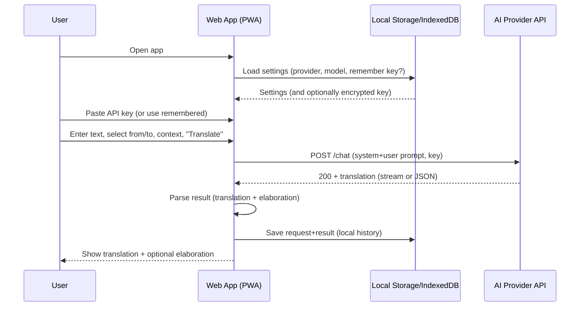
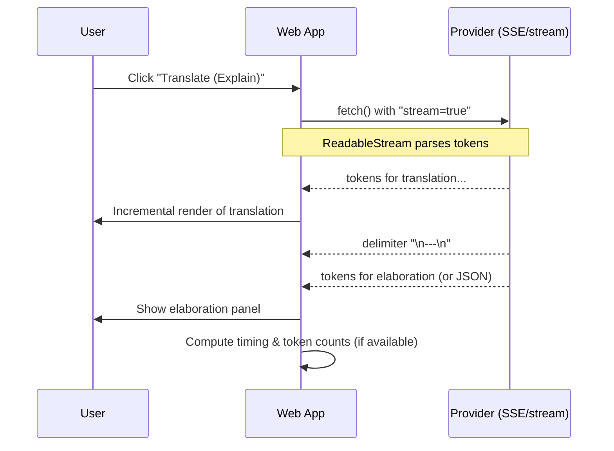

# High-level overview

* **Approach:** 100% client-side web app (PWA) that calls model APIs directly using a user-supplied API key. No backend, no database.
* **Core features:** source/target language selection, optional context, translation output, optional "elaboration" (explain choices, ambiguities, key terms), history (local-only)
- **Advanced features (future work):** voice input/output, camera text capture (OCR)
* **Security posture:** keys never leave the device; optional “Remember my key” stored locally (not cookies); clear UX warnings about risk.

# Tech stack (web first, mobile-ready)

* **UI framework:** React + Vite (fast static build, zero server).

  * Alternatives: Svelte + Vite (lean) or SolidStart static export.
* **TypeScript** for safety and shared logic.
* **Styling:** Tailwind or vanilla CSS modules.
* **State:** Zustand or Redux Toolkit (small surface; works in RN too).
* **PWA:** Workbox (offline shell + icon manifest; still online for API calls).
* **Storage:** `localStorage` (or `indexedDB` via `idb`) for settings/history. Avoid cookies.
* **Model integration:** an **adapter layer** that normalizes calls to providers (OpenAI, Anthropic, Mistral, Groq, Google Gemini, Cohere, etc.). Each adapter exposes:

  * `translate(text, from, to, context?, explain?) -> Promise<{translation, elaboration?}>`
  * `supportsStreaming: boolean`
* **Streaming:** use `fetch` + Web Streams where supported; fall back to non-streaming.
* **Packaging to mobile (two paths):**

  1. **Shared code + React Native (Expo)**: Put model adapters + business logic in a `packages/core` TS library consumed by both web and RN. RN app uses native UI; web uses React DOM.
  2. **Capacitor wrap (fastest)**: Wrap the PWA to iOS/Android; still reuse 100% UI. Later, you can migrate to RN if you need fully native controls.

# Data model (client-only)

```ts
type Settings = {
  provider: 'openai' | 'anthropic' | 'mistral' | 'groq' | 'gemini' | 'cohere' | 'custom';
  apiKeyStored: boolean;
  apiBaseUrl?: string; // for custom/self-hosted endpoints
  model: string;
  defaultFrom?: string; // e.g., 'auto'
  defaultTo?: string;
  explainByDefault?: boolean;
};

type TranslationRequest = {
  id: string;
  text: string;
  from: string; // 'auto' or ISO code
  to: string;   // ISO code
  context?: string;
  timestamp: number;
  provider: Settings['provider'];
  model: string;
  explain: boolean;
};

type TranslationResult = {
  id: string; // same as request
  translation: string;
  elaboration?: string;
  tokensIn?: number;
  tokensOut?: number;
  durationMs?: number;
  error?: string;
};
```

# Prompting & AI integration

* **System prompt (adapter builds this):** "You are an expert translator specializing in cultural and contextual accuracy. Preserve meaning, tone, register, and cultural nuances. Note ambiguities and provide alternatives when helpful."
* **Enhanced user prompt:** includes (a) source language (or "auto"), (b) target language, (c) cultural/situational context, (d) desired politeness level, (e) the text, (f) specific requests (romanization, grammar notes, etc.).
* **Elaboration mode:** structured JSON output with translation confidence, detected language/register, key grammar points, cultural notes, and alternative phrasings.
* **Auto-detect source:** comprehensive language detection including dialect recognition (e.g., Kansai-ben vs. standard Japanese).

# Minimal API call (example)

```ts
// OpenAI-style adapter (non-streaming example)
export async function translateOpenAI(req: TranslationRequest, key: string) {
  const system = `You are an expert translator...`; // trimmed for brevity
  const user = [
    `Source language: ${req.from}`,
    `Target language: ${req.to}`,
    req.context ? `Context: ${req.context}` : '',
    `Text:\n${req.text}`,
    req.explain ? `Also provide a brief explanation...` : ''
  ].filter(Boolean).join('\n\n');

  const res = await fetch("https://api.openai.com/v1/chat/completions", {
    method: "POST",
    headers: { "Content-Type": "application/json", Authorization: `Bearer ${key}` },
    body: JSON.stringify({
      model: req.model,
      messages: [{ role: "system", content: system }, { role: "user", content: user }],
      temperature: 0.2
    })
  });

  if (!res.ok) throw new Error(await res.text());
  const data = await res.json();
  const content = data.choices[0].message.content as string;

  // Parse if you asked for JSON; otherwise split translation/explanation by delimiter.
  const [translation, elaboration] = content.split("\n---\n");
  return { translation: translation?.trim() ?? "", elaboration: elaboration?.trim() };
}
```

# Key UX flows (sequence diagrams)

## High-level (translate)



## Low-level with streaming & “Explain” toggle



# Static architecture (web)

```mermaid
graph TD
  U[User] -->|HTTP(S)| FE[Static Frontend (GitHub Pages)]
  FE --> SW[Service Worker (PWA)]
  FE --> LS[(Local Storage / IndexedDB)]
  FE -->|HTTPS fetch + user key| API[(AI Provider API)]
  subgraph Device
    FE
    SW
    LS
  end
```

# Component breakdown

* **AppShell:** routes, PWA install prompt, error boundary
* **SettingsPanel:** provider, model, "remember my key", base URL (custom), explain default.
* **KeyManager:** in-memory key; optional persist (encrypted blob with passphrase via Web Crypto, if you want).
* **TranslateForm:** text area, from/to selects, context, explain toggle.
* **ResultView:** translation, elaboration panel, copy/share, export.
* **HistoryView:** local history list, re-run with different target language.
* **ProviderAdapter(s):** OpenAI/Anthropic/etc., streaming support, rate/error handling.

# Build, hosting, PWA

* `vite build` → `/dist` → GitHub Pages.
* Add `manifest.json` + icons; Workbox to cache static assets (not API responses).
* Service worker should **bypass** caching for provider calls.

# Security notes (important for a static/browser app)

* **Don’t use cookies** for API keys (they auto-attach to requests). Use memory + optional local encrypted storage with a user passphrase (PBKDF2 + AES-GCM via Web Crypto).
* **Warn users** that browser extensions or shared devices could expose keys.
* **CORS:** Make sure chosen providers allow browser calls from your origin. If any provider blocks browsers, document it in the UI and suggest a user-controlled reverse proxy or “session key” mechanism later.
* **Rate limits & quotas:** Surface provider errors clearly.

# Expansion plan to mobile

**Option A — React Native (preferred for longevity)**

* Create a mono-repo:

  ```
  /apps/web  (React DOM + Vite)
  /apps/mobile (Expo RN)
  /packages/core (adapters, prompts, types, validators)
  /packages/ui   (design system; RN Web compatible)
  ```
* Use **react-native-web** so a chunk of UI is shared between web and RN.
* RN mobile app can store keys in **SecureStore/Keychain** instead of localStorage.

**Option B — Capacitor (fastest)**

* Turn web PWA into native shells quickly.
* Keep code 100% shared; later migrate to RN if you need deeper native features.

# Error handling & telemetry (local)

* Show inline errors (invalid key, 401, 429, CORS).
* Optional lightweight **local** telemetry: compute durations, token counts (if provided) and show per-request stats in History. No remote analytics in static mode.

# Testing

* Unit tests for adapters with mocked `fetch`.
* E2E via Playwright (can run against mock provider endpoints).
* Lint + typecheck in CI (GitHub Actions).

# Example provider-agnostic adapter interface

```ts
export interface ProviderAdapter {
  id: string;
  supportsStreaming: boolean;
  translate(req: TranslationRequest, key: string): Promise<TranslationResult>;
}
```

# Example UI flow (pseudo)

```ts
// on Translate button
const req = buildRequestFromForm();
const key = keyManager.getOrThrow();
setStatus('loading');
try {
  const res = await providerRegistry[currentProvider].translate(req, key);
  saveHistory({ req, res });
  setResult(res);
} catch (e) {
  setError(normalizeError(e));
} finally {
  setStatus('idle');
}
```

# Bonus: structured elaboration

Ask for a short JSON object (and show pretty panels):

```txt
Please return:
TRANSLATION:
<text>

---
ELABORATION (JSON):
{"register":"formal|casual","key_terms":[{"source":"…","target":"…","note":"…"}],
 "detected_source_language":"…","ambiguities":["…", "…"]}
```

# Performance considerations

## Optimization strategies
* **Lazy loading** of heavy dependencies (Tesseract.js, large language models)
* **Service worker caching** for static assets and offline functionality
* **Debounced API calls** to prevent excessive requests during typing
* **Request cancellation** for interrupted translations
* **Progressive loading** of translation results with streaming

# Accessibility & Mobile UX

## Accessibility features
* **Screen reader support** with proper ARIA labels for translation results
* **Keyboard navigation** for all interactive elements
* **High contrast mode** support for visual impairments
* **Font size scaling** respecting user browser settings
* **Focus management** for modal dialogs and dynamic content

## Mobile-first design
* **Touch-friendly interface** with appropriate button sizes (44px minimum)
* **Swipe gestures** for navigation between translation history
* **Mobile-optimized inputs** with appropriate keyboard types
* **Responsive design** that works across all screen sizes
* **PWA installation** with app-like experience
* **Battery optimization** with efficient API usage and background task management